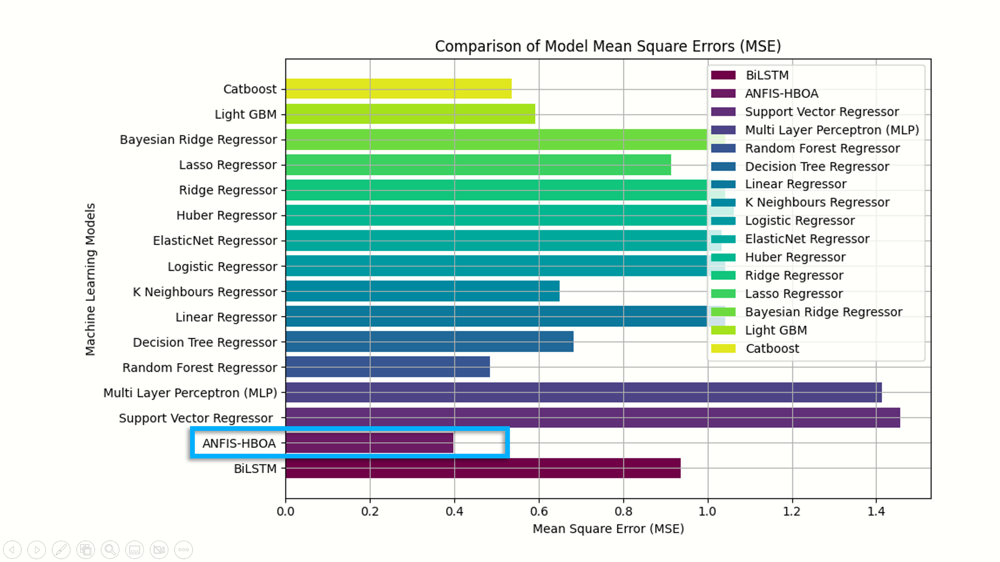

# Crop-Yield-Prediction-using-ML-ANFIS-HBOA
This repository contains a project for predicting crop yields using a hybrid model that combines Adaptive Neuro-Fuzzy Inference System (ANFIS) and Honey Badger Optimization Algorithm (HBOA). The model aims to improve accuracy in yield predictions by integrating the strengths of both techniques.

## Crop Yield Prediction Using ANFIS Optimized with Honey Badger Optimization

### Project Description

This project focuses on predicting crop yields using a high-accuracy model that combines Adaptive Neuro-Fuzzy Inference System (ANFIS) with an innovative optimization technique. By leveraging ANFIS, we aim to capture the complex relationships between various input factors and crop yields, enabling more accurate predictions. The Honey Badger Optimization (HBO) algorithm is employed to enhance the ANFIS model's performance, ensuring optimal parameter tuning and improved prediction accuracy.

### ANFIS Description

**Adaptive Neuro-Fuzzy Inference System (ANFIS)**

ANFIS is a hybrid system that integrates neural networks and fuzzy logic principles to model complex, nonlinear relationships. It combines the learning capabilities of neural networks with the interpretability of fuzzy logic, resulting in a powerful tool for prediction and classification tasks. In this project, ANFIS is used to create a model that learns from historical crop data, capturing the intricate dependencies between various factors such as soil quality, weather conditions, and crop types. The system is trained to map these inputs to yield predictions, providing a robust framework for forecasting crop performance.

### Optimization Algorithm Description

**Honey Badger Optimization Algorithm(HBOA)**

Honey Badger Optimization Algorithm is a recent metaheuristic optimization algorithm inspired by the behavior and characteristics of honey badgers. It is known for its efficiency in exploring and exploiting the search space, making it particularly effective for optimizing complex systems. In this project, HBOA is used to fine-tune the parameters of the ANFIS model, enhancing its accuracy and robustness. By applying HBOA, we ensure that the ANFIS model parameters are optimized to achieve the best possible performance, leading to more reliable and precise crop yield predictions.

### Tech Stack

- **Programming Languages**: Python
- **Machine Learning Frameworks**: TensorFlow, Keras
- **Optimization Algorithm**: Honey Badger Optimization (HBOA)
- **Model**: Adaptive Neuro-Fuzzy Inference System (ANFIS)
- **Data Handling**: Pandas, NumPy
- **Development Environment**: Jupyter Notebook
- **Libraries**: scikit-learn
- **Others**: Matplotlib, Seaborn, Plotly

### Compared Models

- **Adaptive Neuro-Fuzzy Inference System (ANFIS) with Honey Badger Optimization (HBO)**
- LightGBM Regressor
- Support Vector Regression (SVR)
- Random Forest Regressor
- Decision Tree Regressor
- Linear Regression
- K-Nearest Neighbors (KNN) Regressor
- Gradient Boosting Regressor
- XGBoost Regressor
- CatBoost Regressor
- ElasticNet
- Huber Regressor
- Ridge Regression
- Lasso Regression
- Bayesian Ridge Regression
- Simple RNN
- Bidirectional GRU
- Convolutional Neural Network (CNN) with MaxPooling

The Adaptive Neuro-Fuzzy Inference System (ANFIS) optimized with Honey Badger Optimization Algorithm (HBOA) outperformed other models in the crop yield prediction task. Despite using a range of advanced and traditional machine learning algorithms, including ensemble methods, support vector machines, and various neural network architectures, the ANFIS-HBOA model demonstrated superior accuracy and robustness in predicting crop yields, showcasing its effectiveness in handling complex, non-linear relationships within the data.

